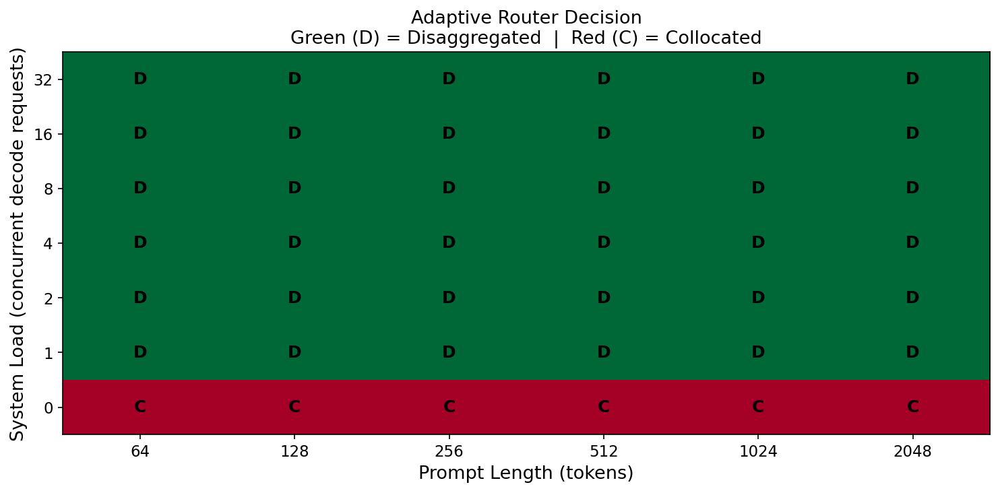
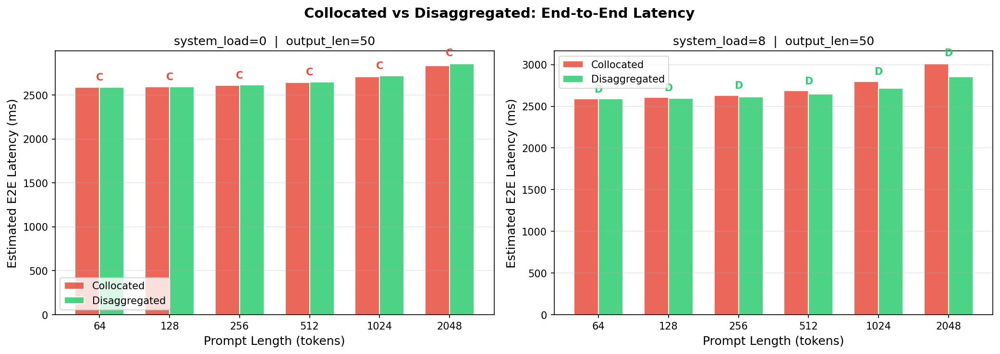
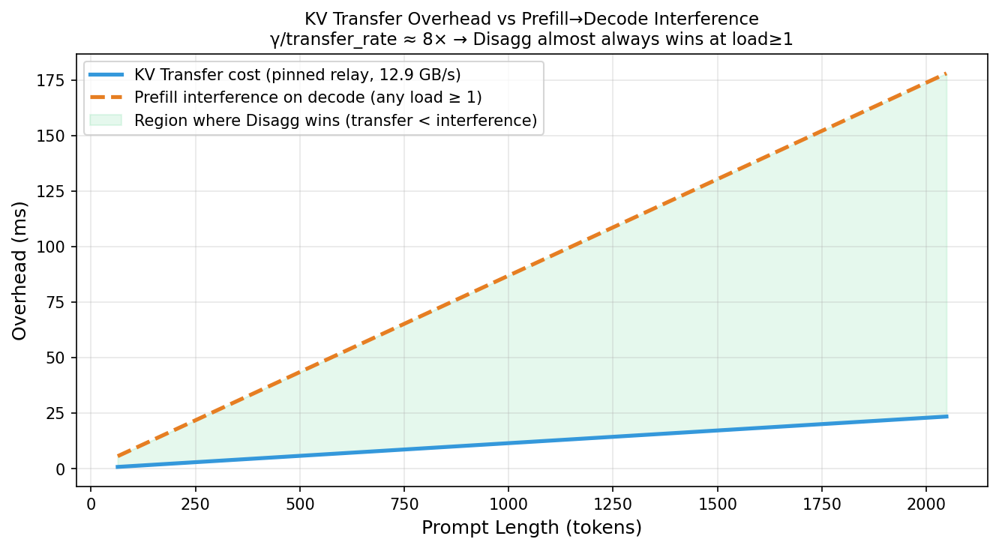
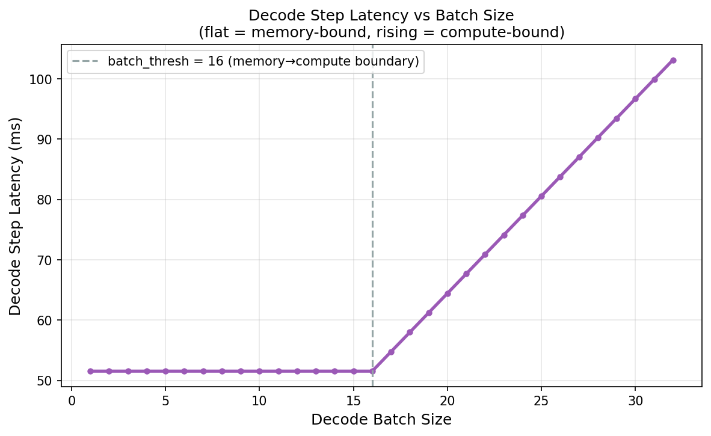

# Cost Model Module

> Source files: `cost_model/profiler.py`, `cost_model/analytical.py`

---

## Overview

The Cost Model module answers one central question: **for an incoming request, should Prefill and Decode run on the same GPU (co-located), or should Prefill run on a dedicated P-GPU and the resulting KV Cache be transferred to a separate D-GPU (disaggregated)?**

The module follows a three-step pipeline: micro-benchmark the real device, fit analytical formulas to the measurements, then make routing decisions from those formulas. **Every parameter comes from actual measurements on the current hardware — nothing is assumed from theory** — so the model adapts automatically to different GPU types and interconnect topologies.

| File | Responsibility |
|---|---|
| `profiler.py` | Dynamic profiling: measures prefill latency, decode latency, mixed-batch interference, and P2P bandwidth on the real device |
| `analytical.py` | Analytical model: fits profiling data, exposes latency estimation and routing decision APIs |
| `params.json` | Fitted parameters (RTX 4090 × 8, pinned memory relay, 12.9 GB/s) |
| `params_h20.json` | Fitted parameters (H20, P2P direct, 392 GB/s) |

---

## profiler.py — Dynamic Device Awareness

### Design rationale

Performance characteristics differ dramatically across hardware (RTX 4090 vs H20) and interconnect types (NVLink P2P vs pinned memory relay). On first deployment, `profiler.py` runs a systematic micro-benchmark suite against the current device and serialises the results to `profile_data.pt` for `analytical.py` to fit. The entire measurement runs through the real inference path (`Engine` + `paged_forward`), so the numbers reflect actual runtime behaviour rather than synthetic benchmarks.

### ProfileResult

```python
@dataclass
class ProfileResult:
    T_prefill       : Dict[int, float]         # prompt_len → latency (ms)
    T_decode        : Dict[Tuple, float]        # (kv_len, batch) → latency (ms)
    T_interference  : Dict[Tuple, float]        # (chunk_size, decode_batch) → extra latency (ms)
    p2p_bandwidth_GBps : float                 # measured inter-GPU bandwidth (GB/s)
```

The four measurements map directly onto the four parameters of the analytical model (α, β, γ, bandwidth).

### Core measurement functions

#### profile_prefill

Measures single-pass prefill latency across a range of prompt lengths; used to fit α.

```
prompt_lens = [64, 128, 256, 512, 1024, 2048]
```

Each length is warmed up 3 times and measured 10 times; the median is taken. Timing uses `torch.cuda.Event` for GPU-side precision, avoiding CPU/GPU synchronisation jitter.

#### profile_decode

Measures single decode-step latency across a grid of KV lengths and batch sizes; used to fit β and `batch_thresh`.

```
kv_lens     = [128, 512, 1024, 2048]
batch_sizes = [1, 4, 8, 16, 32]
```

Constructs B synthetic decode sequences sharing the same `block_table`, injects `_current_context`, and runs the forward pass.

#### profile_interference

Measures the extra latency that a prefill chunk imposes on concurrently executing decode sequences; used to fit γ.

Methodology:

```
measure pure-decode baseline  (B sequences, kv_len=512)
measure mixed batch            (chunk_size prefill tokens + B decode sequences)
interference = t_mixed - t_baseline
```

kv_len is fixed at 512. A grid search over `chunk_sizes=[64, 128, 256, 512]` × `decode_batches=[4, 8, 16]` captures the linear growth of interference with chunk size.

#### profile_p2p_bandwidth

Detects the actual available inter-GPU bandwidth:

- If P2P direct is available (`_check_p2p()` returns True): measures NVLink/PCIe P2P bandwidth via `dst.copy_(src)`;
- Otherwise (e.g. multi-GPU servers without NVLink): measures the pinned memory relay path (`src → cpu_buf → dst`), reflecting the real transfer cost.

### run_full_profile

```python
def run_full_profile(model_path, output_path, src_gpu, dst_gpu) -> ProfileResult
```

Runs all four measurements in sequence and serialises the `ProfileResult` to disk with `torch.save()`, ready for `AnalyticalCostModel.fit_from_profile()`.

---

## analytical.py — Analytical Model and Routing Decisions

### CostModelParams

```python
@dataclass
class CostModelParams:
    alpha            : float  # T_prefill(L) ≈ α × L               (ms/token)
    beta             : float  # decode step latency at batch=1       (ms/step)
    batch_thresh     : float  # batch size at the memory→compute boundary
    gamma            : float  # interference coefficient: T_interf ≈ γ × chunk_tokens (ms/token)
    bandwidth_GBps   : float  # measured inter-GPU transfer bandwidth (GB/s)
    bytes_per_token  : int    # KV Cache bytes per token
                              # Qwen3-8B: 36 layers × 8 KV heads × 128 dim × 2(K+V) × 2 bytes = 147456
```

#### Measured parameters — hardware comparison

| Parameter | RTX 4090 × 8 (pinned relay) | H20 (P2P direct) |
|---|---|---|
| α | 0.1247 ms/token | 0.1452 ms/token |
| β | 51.56 ms/step | 33.10 ms/step |
| batch_thresh | 16 | 16 |
| γ | 0.0869 ms/token | 0.1302 ms/token |
| bandwidth | 12.9 GB/s | 392 GB/s |
| transfer_rate | 0.01143 ms/token | 0.000376 ms/token |
| **γ / transfer_rate** | **~7.6×** | **~346×** |

`γ / transfer_rate` is the key ratio driving routing decisions (see below).

---

### AnalyticalCostModel

#### Construction

```python
# Fit from profiling data (first deployment)
model = AnalyticalCostModel.fit_from_profile("profile_data.pt", save_params_path="params.json")

# Load pre-fitted parameters (everyday use)
model = AnalyticalCostModel.load_params("params.json")
```

#### Fitting logic (fit_from_profile)

| Parameter | Fitting method |
|---|---|
| α | Linear regression `T = α × L` on `T_prefill` data via `scipy.optimize.curve_fit` |
| β | Median of decode latency measurements at batch=1 across all kv lengths |
| batch_thresh | Grid search over sampled batch values; pick the threshold minimising MSE for `β × max(1, B/thresh)` |
| γ | Linear regression `T_interf = γ × chunk_size` on batch=8 interference data |

---

### Latency estimation methods

```python
def t_prefill(self, prompt_len) -> float
    # α × prompt_len
```

```python
def t_transfer(self, prompt_len) -> float
    # prompt_len × bytes_per_token / (bandwidth × 1e6)  (ms)
    # time to transfer the completed KV Cache via pinned relay or P2P
```

```python
def t_decode_step(self, batch_size) -> float
    # batch ≤ batch_thresh : β              (memory-bound: bandwidth wall, flat with batch)
    # batch > batch_thresh : β × (batch / batch_thresh)  (compute-bound: grows linearly)
```

```python
def t_decode_total(self, output_len, batch_size) -> float
    # t_decode_step(batch_size) × output_len
```

```python
def t_collocated(self, prompt_len, output_len, system_load, chunk_size=256) -> float
    # t_prefill + t_decode_total(batch=system_load) + t_interference
    # t_interference = γ × prompt_len × min(system_load, batch_thresh) / batch_thresh
    #                  (zero when system_load=0; saturates at batch_thresh)
```

```python
def t_disaggregated(self, prompt_len, output_len) -> float
    # t_prefill + t_transfer + t_decode_total(batch=1)
```

---

## Routing Decision (route) — Detailed Analysis

```python
def route(self, prompt_len, predicted_output_len, system_load,
          decode_batch_size=1, chunk_size=256) -> Tuple[str, float, float]
```

Computes the estimated end-to-end latency for both routing strategies and picks the lower one:

```python
t_c = t_collocated(prompt_len, output_len, system_load, chunk_size)
t_d = t_prefill(prompt_len) + t_transfer(prompt_len)
    + t_decode_total(output_len, batch_size=decode_batch_size + 1)

decision = "disaggregated" if t_d < t_c else "collocated"
```

Returns `(decision, t_collocated, t_disaggregated)`.

### Cost breakdown for each strategy

**Collocated:**

```
T_collocated = T_prefill(L)
             + T_decode_total(output_len, batch = system_load)
             + T_interference(L, system_load)
```

- Prefill and Decode compete for the same GPU's compute;
- The effective decode batch size equals the total number of requests currently running on the system;
- The prefill's matrix multiplications and the decode's Paged Attention share SM resources — prefill imposes extra latency on decode, quantified as `γ × prompt_len × load_factor`.

**Disaggregated:**

```
T_disaggregated = T_prefill(L)          [P-GPU]
                + T_transfer(L)          [KV Cache transfer]
                + T_decode_total(output_len, batch = decode_batch_size + 1)  [D-GPU]
```

- Prefill runs on a dedicated P-GPU; Decode runs on a dedicated D-GPU — no mutual interference;
- The only extra cost is transferring the completed KV Cache from P-GPU to D-GPU;
- The decode batch on the D-GPU is `decode_batch_size + 1` (the +1 accounts for this new request joining).

### Routing intuition

#### Case 1: Zero system load (system_load = 0)

No other decode requests are running, so:
- `T_interference = 0` (nothing to interfere with)
- Co-located decode at batch=1 and disaggregated decode at batch=2 have the same per-step cost (both within the memory-bound flat region)

Collocated avoids the transfer entirely, so it almost always wins at zero load.

#### Case 2: Moderate load (1 ≤ system_load < batch_thresh)

The decision reduces to comparing two terms that are both linear in `prompt_len`:

- Extra cost of disaggregated: `transfer_rate × L`
- Extra cost of collocated: `γ × L × (system_load / batch_thresh)`

Disaggregated wins when interference exceeds transfer cost:

```
γ × (system_load / batch_thresh) > transfer_rate
⟹ system_load > batch_thresh × (transfer_rate / γ)
```

Substituting RTX 4090 parameters (`γ / transfer_rate ≈ 7.6`):

```
system_load > 16 × (1 / 7.6) ≈ 2.1
```

**From system_load ≥ 3, the interference cost alone exceeds the transfer cost — Disaggregated wins.**

Substituting H20 parameters (`γ / transfer_rate ≈ 346`):

```
system_load > 16 × (1 / 346) ≈ 0.05
```

**On H20, transfer is so fast that Disaggregated wins at virtually any non-zero load.**

#### Case 3: High load (system_load > batch_thresh)

Decode enters the compute-bound region; `t_decode_step` grows linearly with batch:

- Collocated decode: `β × (system_load / batch_thresh)` per step → total latency can double or more;
- Disaggregated decode: batch is only `decode_batch_size + 1` (typically well below `batch_thresh`) → latency stays at β.

At high load, collocated total decode latency can be several times higher than disaggregated; the router almost always picks Disaggregated.

### Routing decision summary

| System load | RTX 4090 tendency | H20 tendency | Dominant factor |
|---|---|---|---|
| load = 0 | Collocated | Collocated | No transfer, no interference — Collocated has zero extra cost |
| 1 ≤ load ≤ 2 | Collocated | **Disaggregated** | H20 transfer is negligible; interference already exceeds it |
| 3 ≤ load ≤ batch_thresh | **Disaggregated** | **Disaggregated** | Interference cost > transfer cost |
| load > batch_thresh | **Disaggregated** | **Disaggregated** | Collocated decode enters compute-bound; latency multiplies |

### Concrete example (RTX 4090, L=512, output_len=200)

| system_load | T_collocated | T_disaggregated | Decision |
|---|---|---|---|
| 0 | 10376 ms | 10382 ms | Collocated |
| 4 | 10387 ms | 10382 ms | Disaggregated |
| 16 | 10420 ms | 10382 ms | Disaggregated |
| 32 | 20732 ms | 10382 ms | **Disaggregated (2× gap)** |

At load=32 the decode phase becomes compute-bound and collocated total latency doubles; the disaggregated advantage is substantial.

---

## Visualisation (plot_all)

```python
def plot_all(self, output_dir, output_len=200, chunk_size=256) -> List[str]
```

Generates four analysis figures and saves them to `output_dir/`. The results below are from the RTX 4090 × 8 (pinned relay) deployment.

---

### Fig 1 — Routing Decision Heatmap



**Reading the figure**: the boundary is stark — the entire bottom row (load=0) is red (Collocated), and every other cell is green (Disaggregated).

**What this means**: on RTX 4090, the moment even a single concurrent decode request exists, the router switches to Disaggregated for all prompt lengths. The X axis (prompt_len) has essentially no influence on the decision.

**Why**: the 4090's inter-GPU bandwidth via pinned memory relay is only ~12.9 GB/s, giving `transfer_rate ≈ 0.0114 ms/token`. The interference coefficient `γ ≈ 0.0869 ms/token` is **7.6× higher**. Even at load=1, where interference is damped by `batch_thresh` to `γ/16 ≈ 0.0054 ms/token`, the overall latency comparison still tips in favour of Disaggregated once both full cost equations are evaluated.

---

### Fig 2 — End-to-End Latency Comparison



**Left panel (load=0)**: both bars are nearly equal height; Collocated is marginally lower (< 0.1% difference), labelled C throughout. This confirms that at zero load, skipping the transfer gives Collocated a small but real edge.

**Right panel (load=8)**: the Disaggregated bars (green) are noticeably shorter, and the gap grows with prompt length. The arithmetic is straightforward:

```
extra interference cost : γ × L × (8/16) = 0.0869 × L × 0.5 ≈ 0.043 × L  ms
extra transfer cost     : transfer_rate × L = 0.0114 × L ms
net difference          ≈ 0.032 × L ms  (interference is 3.8× more expensive per token)
```

At L=2048, the gap is ~65 ms — significant relative to the total latency of a short (output_len=50) generation.

---

### Fig 3 — Transfer Overhead vs Prefill Interference



This is the most revealing figure for understanding 4090 routing behaviour.

- **Blue line (transfer cost)**: very shallow slope; reaches ~23 ms at 2048 tokens. This directly reflects the 12.9 GB/s pinned relay bandwidth — slow enough that each token's 147 KB of KV data takes a non-trivial amount of time to move.
- **Orange dashed line (interference cost)**: slope is ~7.6× steeper; reaches ~175 ms at 2048 tokens. Sharing SM resources between prefill matrix multiplications and Paged Attention is far more expensive than shipping the KV Cache across.
- **Green shaded region**: where transfer < interference. It covers virtually the entire plot from near zero tokens onward.

**Bottom line**: on RTX 4090, *moving the KV Cache to another GPU* is 7.6× cheaper than *leaving it in place and letting Prefill disrupt Decode*. The economic case for Disaggregated is clear.

---

### Fig 4 — Decode Step Latency vs Batch Size



The figure shows the classic two-regime latency curve:

- **Flat region (batch 1→16, ~51 ms/step)**: Decode is memory-bandwidth-bound. Adding more sequences doesn't increase latency — the GPU's compute units sit mostly idle while waiting for KV Cache data;
- **Linear rise (batch > 16)**: Decode becomes compute-bound; latency grows proportionally. At batch=32 the step time is ~105 ms, exactly 2× β (32/16 = 2);
- **Dashed vertical line (batch_thresh=16)**: the fitted crossover point, matching the visual inflection precisely.

This curve explains why Collocated's disadvantage accelerates sharply at high load: once `system_load` exceeds 16, every additional co-located request adds proportionally more decode latency, while Disaggregated's D-GPU decode batch stays in single digits and remains in the flat memory-bound region.

---

## Usage

```python
from cost_model.analytical import AnalyticalCostModel

# First deployment: profile then fit (requires the model to be loaded)
from cost_model.profiler import run_full_profile
run_full_profile(model_path, output_path="cost_model/profile_data.pt")
model = AnalyticalCostModel.fit_from_profile(
    "cost_model/profile_data.pt",
    save_params_path="cost_model/params.json"
)

# Everyday use: load pre-fitted parameters
model = AnalyticalCostModel.load_params("cost_model/params.json")

# Make a routing decision
decision, t_c, t_d = model.route(
    prompt_len=512,
    predicted_output_len=200,
    system_load=8,          # number of requests currently decoding on the system
    decode_batch_size=1,    # current decode batch size on the target D-GPU
    chunk_size=256
)
# decision: "disaggregated" or "collocated"
```
