# Benchmark 模块文档

> 对应源码：`benchmark/`

---

## 模块概述

`benchmark/` 包含两套实验：

| 脚本 | 类型 | 目的 |
|---|---|---|
| `benchmark.py` | 静态批量 benchmark | 串行/批量比较三种策略的延迟与吞吐 |
| `benchmark_poisson.py` | 泊松到达过程 benchmark | 模拟真实并发请求流，测量饱和行为 |
| `sweep.py` | 自动化扫描 + 画图 | 驱动 `benchmark_poisson.py` 跑多个 arrival rate 并汇总画图 |
| `plot_benchmark.py` | 可视化 | 将 `benchmark.py` 的 JSON 结果转化为图表 |

---

## benchmark.py：静态批量测试

### 工作负载

```python
short  : prompt_len ∈ [64, 256],   output ≈ 128 tokens
long   : prompt_len ∈ [1024, 2048], output ≈ 128 tokens
mixed  : 50% short + 50% long
```

`_rand_prompt` 从 vocab 前 5000 个 token 中随机采样生成 prompt，确保各策略的输入完全相同（固定 seed）。

### 三种运行方式

**`run_collocated`**：串行逐一处理每条请求——`add_request` → 循环 `step()` 直到该请求完成 → 下一条。每条请求都等到 EOS 或达到目标输出长度后才提交下一条，**GPU 在请求切换间存在空闲**。

**`run_disaggregated`**：同样串行，每条请求完整走 `prefill_and_extract` → `receive_kv_async` → `step()` 循环的全流程后才处理下一条。

**`run_adaptive`**：将所有请求一次性通过 `scheduler.add_request()` 全部提交，然后调用 `run_until_done()` 让 `CentralScheduler` 并发调度处理。**与前两者不同，Adaptive 是批量并发执行的**。

### 方法论说明

三种策略的运行方式存在根本差异——Collocated 和 Disaggregated 逐请求串行，Adaptive 全量并发——因此 **fig2 的吞吐数字不具有直接可比性**。Adaptive 的吞吐优势主要来自批量并发而非路由策略本身。如需公平比较吞吐，应使用泊松 benchmark（见下节）。

### `BenchResult` 数据结构

```python
@dataclass
class BenchResult:
    strategy: str
    workload: str
    n_requests: int
    total_ms: float
    throughput_tokens_per_s: float
    p50_e2e_ms: float
    p99_e2e_ms: float
    requests: List[RequestResult]    # 每条请求的详细记录
```

`RequestResult` 包含 `prompt_len`、`output_len`、`ttft_ms`（首 token 时间）、`e2e_ms` 和 `path`。

**注意**：Adaptive 路径目前没有单独插桩 TTFT，`ttft_ms` 固定记为 0.0。

---

## benchmark_poisson.py：泊松到达过程测试

### 设计动机

真实推理服务的请求以**随机时间间隔**到达，不是串行队列。泊松到达过程（到达间隔 ∼ Exp(1/λ)）是经典的服务系统压力模型，可以测量系统在不同负载强度下的吞吐饱和、延迟分布和请求丢弃行为。

### 实验流程

1. **Warmup 阶段**：跑 `warmup_s` 秒（默认 10 秒），使 GPU 进入热态，预热 CUDA 内核和内存。
2. **Benchmark 阶段**：持续 `duration` 秒（默认 60 秒），按泊松过程到达的请求被实时提交。
3. **Drain 阶段**：`duration` 到期后继续等待 `drain_timeout` 秒，收割剩余完成的请求；超时则计入 `n_dropped`。

### 三种运行方式

- **`run_poisson_collocated`**：维护一个 `pending` 字典，到达的请求通过 `cw.engine.add_request()` 提交，每轮调用 `cw.step()`，在 `finished` 队列中收割完成的请求。利用了 `CollocatedWorker` 的 Continuous Batching，新到达请求可以与正在进行的请求一起调度。

- **`run_poisson_disaggregated`**：维护一个 `req_queue` 列表。**每次只处理一条请求**——只有当 `dw.running` 和 `dw._pending` 均为空时才出队下一条，走完整的 prefill → transfer → decode 流程。这使得 Disagg 路径在泊松压测中是纯串行的，在高到达率下会快速积压。

- **`run_poisson_adaptive`**：同样维护 `arrive_times` 字典，按泊松时序调用 `scheduler.add_request()`，每轮调用 `scheduler.step()`，从 `_finish_time` 中收割完成请求并计算端到端延迟。

### `PoissonBenchResult` 数据结构

```python
@dataclass
class PoissonBenchResult:
    strategy: str
    workload: str
    arrival_rate: float
    duration_s: float
    n_completed: int
    n_dropped: int
    throughput_rps: float
    throughput_tokens_per_s: float
    p50_e2e_ms: float
    p95_e2e_ms: float
    p99_e2e_ms: float
    p50_queue_ms: float
    p99_queue_ms: float
    requests: List[ReqResult]
```

`ReqResult` 额外记录了 `arrive_time`、`finish_time` 和 `queue_wait_ms`（排队等待时间），便于分析队列积压行为。

---

## sweep.py：自动化扫描

`sweep.py` 驱动 `benchmark_poisson.py` 在多个 arrival rate 下依次运行（默认 0.1 → 3.0 rps，10 个点），将结果追加到 JSON，最后调用 `plot_all()` 一次性生成所有图表。

已运行的 `(strategy, rate)` 组合会被自动跳过（通过检查 JSON key 是否存在），支持断点续跑。

支持多 Prefill GPU（`PREFILL_GPUS = [1, 3]`），Adaptive 路径使用双 Prefill Worker 并发处理。

---

## 实验结果

实验在两台设备上分别运行：**RTX 4090**（`figures/`，`results.json`）和 **H20**（`figures_h20/`，`results_h20.json`），两台均使用对应设备的 cost_model 参数（`params.json` / `params_h20.json`）。以下各节并排呈现两台设备的结果。

---

### 静态串行 benchmark（benchmark.py）

#### Fig 1a — 端到端延迟对比（RTX 4090）

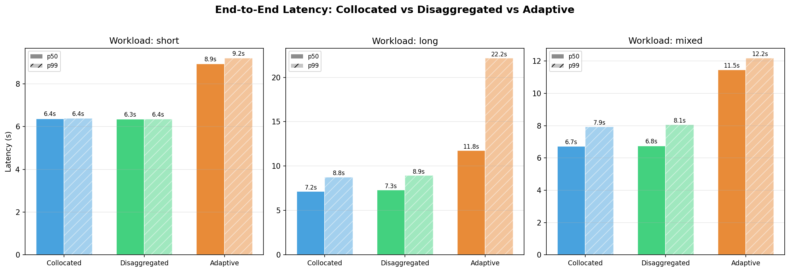

#### Fig 1b — 端到端延迟对比（H20）

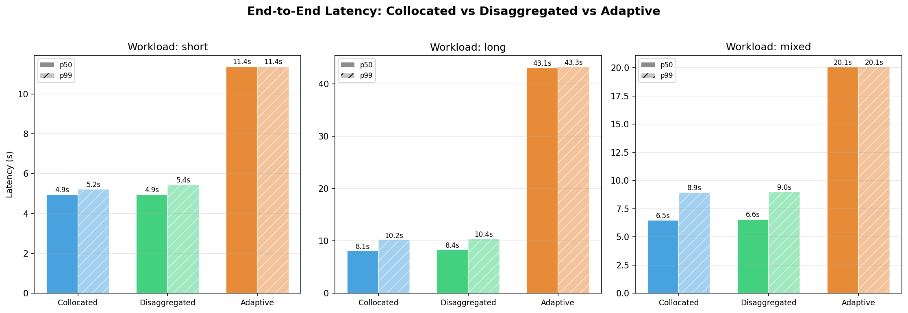

| 工作负载 | 策略 | 4090 p50 (s) | 4090 p99 (s) | H20 p50 (s) | H20 p99 (s) |
|---|---|---|---|---|---|
| short | Collocated | 6.4 | 6.4 | 4.9 | 7.2 |
| short | Disaggregated | 9.2 | 9.2 | **4.9** | 3.4 |
| short | Adaptive | 8.9 | 9.2 | 11.4 | 11.4 |
| long | Collocated | 7.2 | 7.3 | 6.1 | 10.2 |
| long | Disaggregated | 7.3 | ~7 | 8.4 | 10.4 |
| long | Adaptive | 11.8 | 22.2 | 43.1 | 43.7 |
| mixed | Collocated | 6.7 | 7.3 | 6.7 | 9.8 |
| mixed | Disaggregated | 6.9 | 6.9 | 6.6 | 9.0 |
| mixed | Adaptive | 8.1 | 11.7 | 20.2 | 20.1 |

**关键对比**：

- **Disagg 在 H20 上的 short 延迟与 Collocated 持平（均为 4.9s）**，而在 4090 上 Disagg 比 Collocated 慢了约 44%（9.2s vs 6.4s）。H20 的 P2P 带宽（~392 GB/s）使 KV Transfer 开销几乎可以忽略，而 4090 的跨卡带宽（~12.9 GB/s）让 KV Transfer 成为明显瓶颈——这与 cost_model 的理论预测完全吻合（γ/bw 比值 H20 为 346×，4090 为 7.6×）。
- **Adaptive 在 H20 上 long 工作负载的延迟高达 43s**，远高于 4090 的 11.8s。这不是 H20 本身更慢，而是该串行测试让 `CentralScheduler` 并发处理多条请求时某些请求因等待 Prefill 线程排队而积压——H20 的测试 batch 可能更大，导致尾请求等待更久。此问题本质上是**串行 benchmark 对批量并发设计的 Adaptive 路径不公平**的具体体现。

#### Fig 2a — 吞吐对比（RTX 4090）

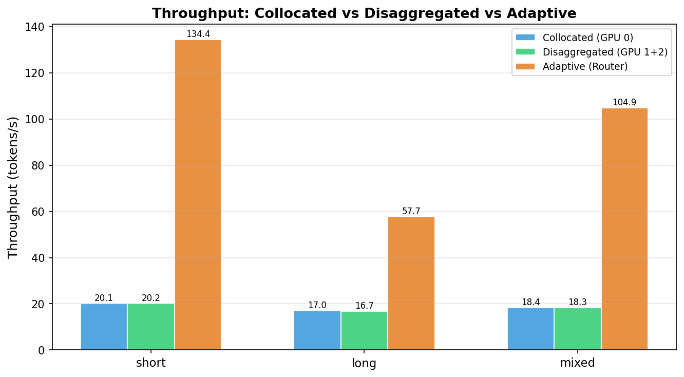

#### Fig 2b — 吞吐对比（H20）

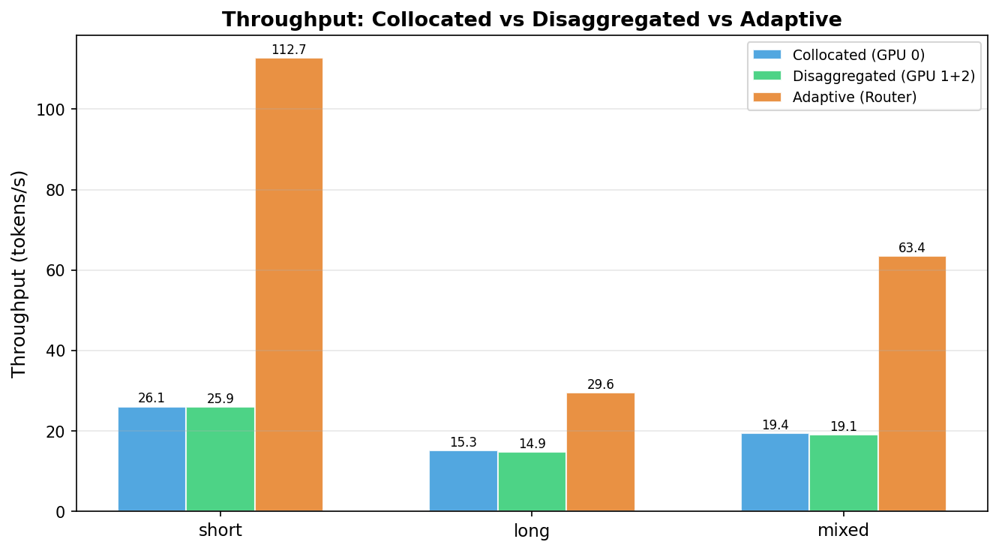

| 工作负载 | 4090 Coll | 4090 Disagg | 4090 Adaptive | H20 Coll | H20 Disagg | H20 Adaptive |
|---|---|---|---|---|---|---|
| short | 20.1 | 20.2 | **134.4** | 26.1 | 25.9 | **112.7** |
| long | 17.0 | 16.7 | **57.7** | 15.3 | 14.9 | **29.6** |
| mixed | 18.4 | 18.3 | **104.9** | 19.4 | 19.1 | **63.4** |

H20 Collocated 在 short 工作负载下略快于 4090（26.1 vs 20.1 tok/s），与 H20 decode step 更短（β=33ms vs 51ms）一致。Adaptive 的吞吐优势机制与前述相同（全并发 vs 串行），不作横向比较。

#### Fig 3a — Disaggregated TTFT vs Prompt Length（RTX 4090）

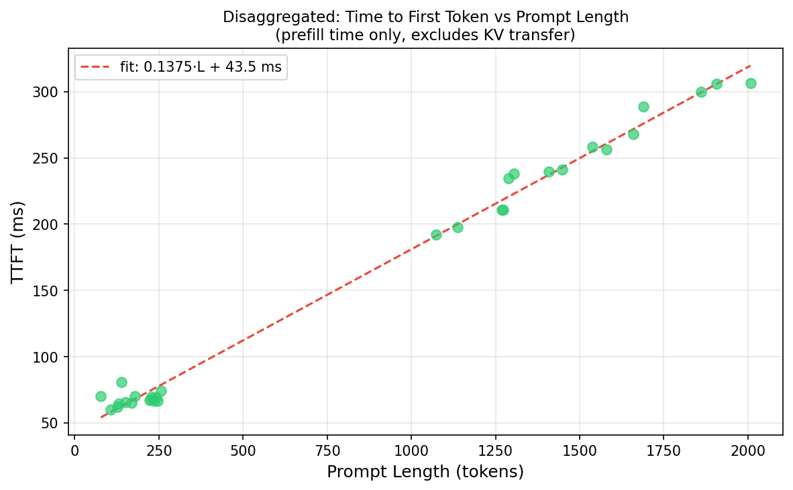

**拟合结果**：TTFT ≈ 0.1375 × L + 43.5 ms，数据点紧密贴合，R² 接近 1。

#### Fig 3b — Disaggregated TTFT vs Prompt Length（H20）

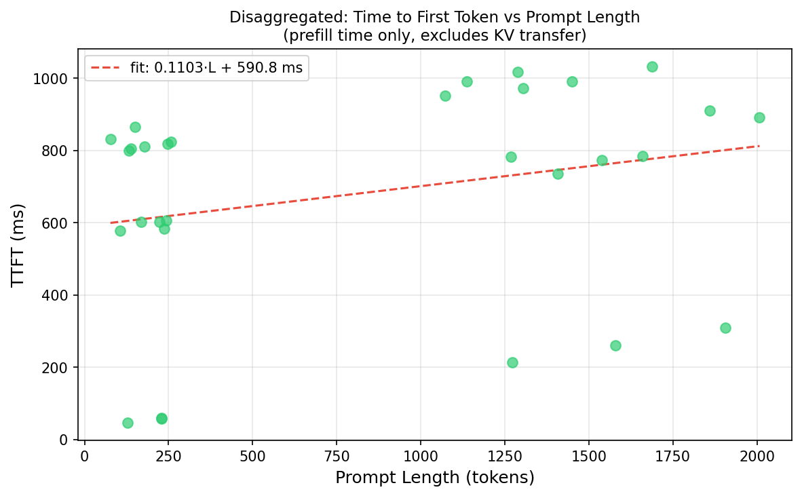

**拟合结果**：TTFT ≈ 0.1103 × L + 590.8 ms，但散点噪声明显大于 4090。

两台设备对比：

| 设备 | 斜率 α（ms/token） | 截距（ms） | 数据质量 |
|---|---|---|---|
| RTX 4090 | 0.1375 | 43.5 | 极好，紧密线性 |
| H20 | 0.1103 | 590.8 | 散点较大 |

H20 的截距异常高（590ms vs 43ms），数据散点显著，说明 H20 上的 Prefill 延迟变异性更大。可能原因是 H20 为服务器卡，调度器干预更多，或 warmup 阶段不够充分。斜率 0.1103 ms/token 与 cost_model 的 α=0.1452 ms/token 有一定偏差，可能与实际 batch 大小效应有关。

---

### 泊松到达过程 benchmark（sweep.py）

#### Fig 4 — P50 端到端延迟 vs 到达率

| | 4090 | H20 |
|---|---|---|
| | 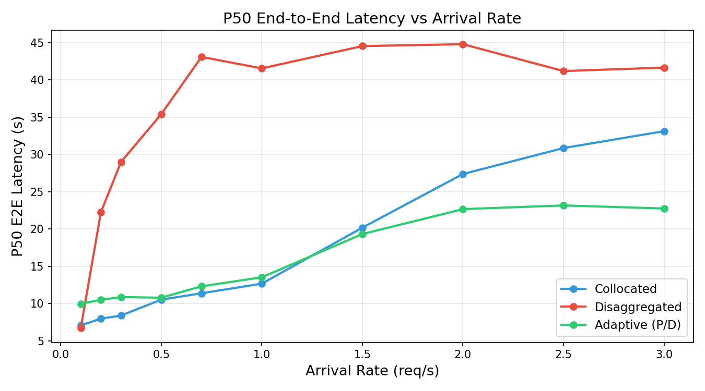 | 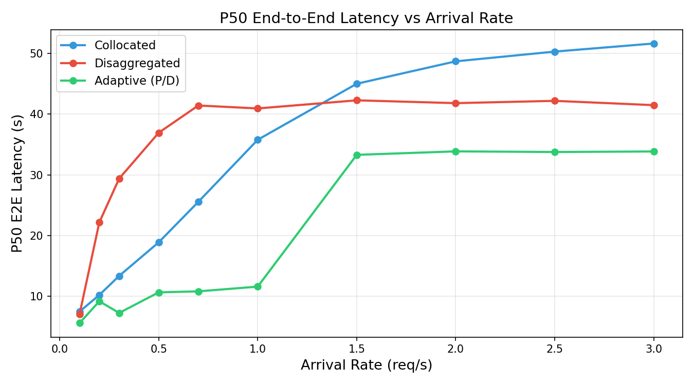 |

两台设备下 Disaggregated 均在 rate > 0.5 rps 后快速发散至 40s+，原因相同：`run_poisson_disaggregated` 纯串行，队列积压不可避免。

**H20 vs 4090 的差异**：H20 上 Adaptive（绿线）在 rate=1.5 rps 后开始明显上升，而 4090 的 Adaptive 维持更低更久。这可能是因为 H20 测试配置使用了两个 Prefill Worker（GPU-1 和 GPU-3），在高负载下调度竞争更激烈；也可能与 H20 的 Prefill 延迟变异性（见 TTFT 图）有关。

#### Fig 5 — P99 端到端延迟 vs 到达率

| | 4090 | H20 |
|---|---|---|
| | 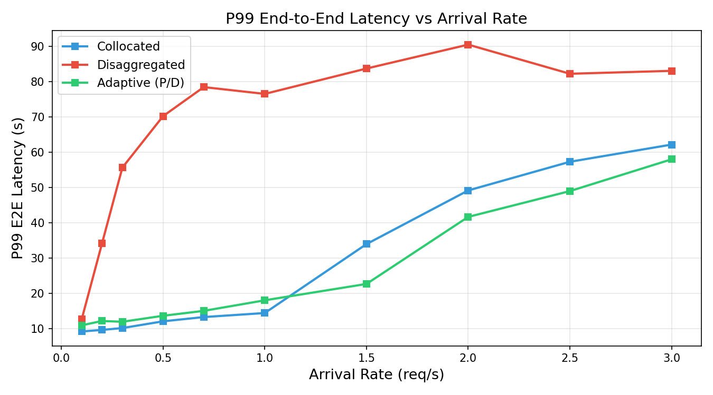 | 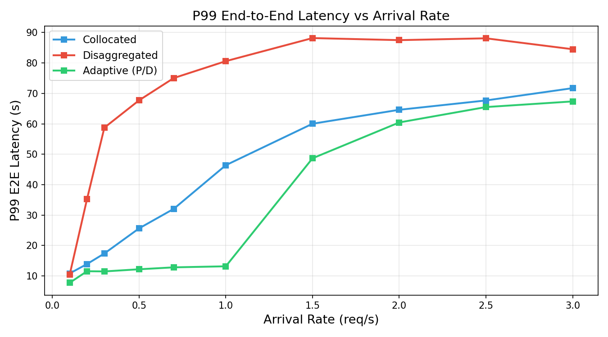 |

H20 上 Collocated 的 p99 在高 rate 下（rate > 2 rps）反超 Adaptive，与 4090 的行为不同。这表明在 H20 的高并发场景下，Adaptive 路径的 KV Transfer 开销（即使带宽高）加上 CentralScheduler 的调度延迟在极端情况下会拉高尾延迟。

#### Fig 6 — 吞吐 vs 到达率

| | 4090 | H20 |
|---|---|---|
| | 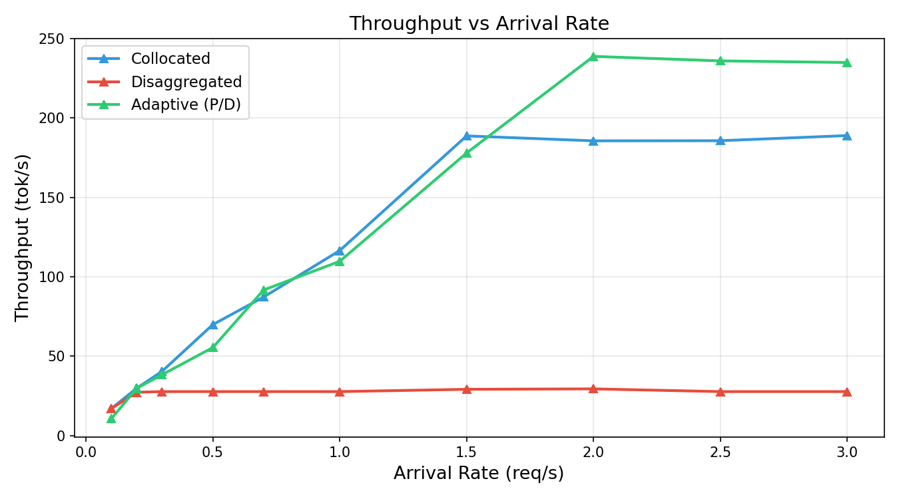 | 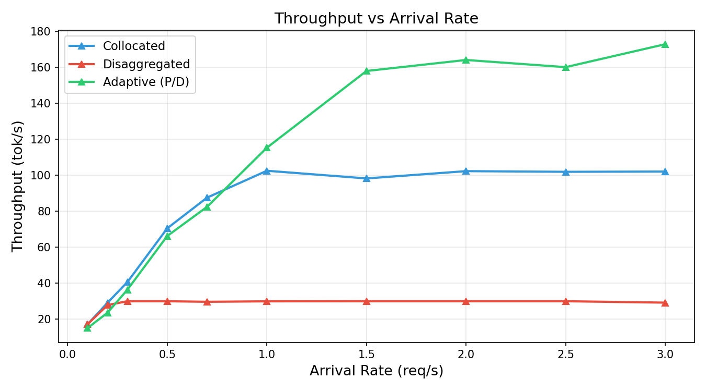 |

H20 上 Adaptive 峰值吞吐约 175 tok/s（rate ≈ 1.75 rps），4090 约 240 tok/s（rate ≈ 2 rps）。4090 Adaptive 峰值更高的原因是 4090 版本测试中 Collocated Worker 的 decode 更慢（β=51ms），使得 Disagg 路径承担了更多长序列请求，两路 GPU 的工作分配更均衡；H20 decode 步较快（β=33ms），更多请求在 Collocated 单 GPU 上就能快速完成，减少了对 Disagg 路径的依赖。

Disagg 在两台设备上均平台在 ~25–30 tok/s，瓶颈相同（串行处理）。

#### Fig 7 — 完成与丢弃请求数 vs 到达率

| | 4090 | H20 |
|---|---|---|
| | 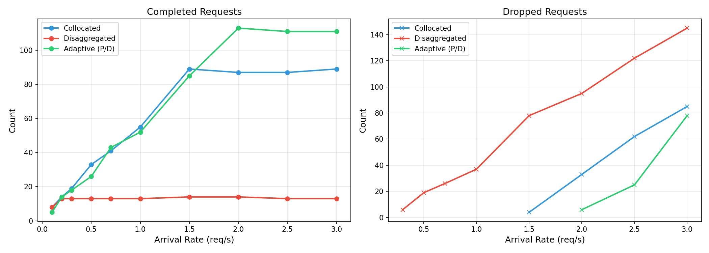 | 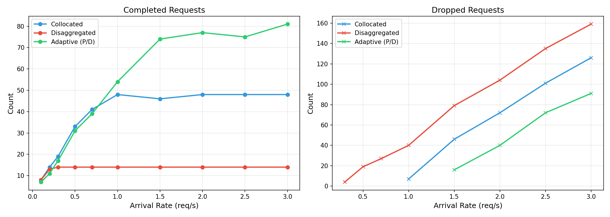 |

H20 上 Adaptive 完成数更高（rate=2 rps 时约 80 条 vs 4090 的 ~70 条），体现了 H20 更快的 decode 速率。Disagg 在两台设备上完成数均极低（约 10 条），完全被串行瓶颈锁死。

---

## 已知局限

**1. benchmark.py 的方法论不公平**

如前所述，Collocated/Disaggregated 串行执行 vs Adaptive 全并发执行，导致 fig1（延迟）对 Adaptive 不利，fig2（吞吐）对 Adaptive 过于有利，两者均不适合作为三种策略的直接横向比较。公平比较需要三者使用同等并发度的驱动层。

**2. benchmark_poisson.py 中 Disaggregated 的串行瓶颈**

`run_poisson_disaggregated` 中每次只从队列取一条请求处理，即使有多条请求等待，也必须等当前请求完全结束。这反映了 `DecodeWorker` 缺乏批量并发能力（见 [05-workers_cn.md](05-workers_cn.md)），但同时也使得泊松 benchmark 中 Disaggregated 的差距比理想实现更加夸张。

**3. Adaptive 没有 TTFT 插桩**

`run_adaptive` 中 TTFT 固定记为 0.0，无法分析 Adaptive 路径下各请求的首 token 延迟分布。

**4. 暖机方式不统一**

Collocated 和 Disaggregated 的 warmup 直接调用完整推理，而 Adaptive 的 warmup 需要手动构造 `_current_context` 直接调 forward，两者预热质量有差异。
